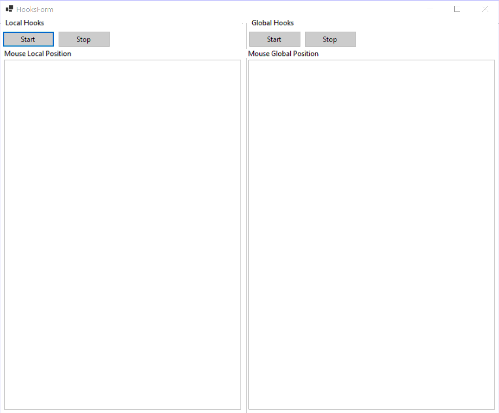

# Windows Hooks

This application showcases the use of Windows [Hooks](https://learn.microsoft.com/en-us/windows/win32/winmsg/hooks). It injects a custom subroutines (event handlers) that monitor Mouse and Keyboard messages and perform simple operation before those messages reach target window.

## Application Flow

On application startup, the application displays a Windows Forms split into 2 sections.
- The first one installs the hooks only for current module meaning mouse position will be intercepted only when the cursor is inside application's window area, the clicks and keyboard events are processed only when the application's windows is active. In this case the hook subscribes to [WH_MOUSE](https://learn.microsoft.com/en-us/windows/win32/winmsg/about-hooks#wh_mouse) and [WH_KEYBOARD](https://learn.microsoft.com/en-us/windows/win32/winmsg/about-hooks#wh_keyboard) messages.
- The second one installs global hooks. This allows receiving messages from outside current application window scope by subscribing to low level [WH_MOUSE_LL](https://learn.microsoft.com/en-us/windows/win32/winmsg/about-hooks#wh_mouse_ll) and [WH_KEYBOARD_LL](https://learn.microsoft.com/en-us/windows/win32/winmsg/about-hooks#wh_keyboard_ll) messages.

**Note:** it is not possible to subscribe to low level messages for the application window, thus higher level alternatives are used. On the other hand these raise more complex messages (ex: double click, key press). In case of low level hooks a timer should be used to identify more complex messages.

